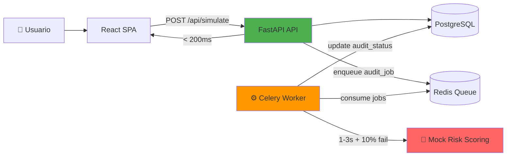

# CreditSim

> Simulador de créditos con amortización francesa, auditoría asíncrona y arquitectura hexagonal.

**Demo:** [creditsim.iayala.dev](https://creditsim.iayala.dev)  
**API Docs:** [creditsim.iayala.dev/api/docs](https://creditsim.iayala.dev/api/docs)  
**OpenAPI Spec:** [creditsim.iayala.dev/api/openapi.json](https://creditsim.iayala.dev/api/openapi.json) - Importar en Postman/Insomnia

[](https://github.com/IrvingAA/creditsim/actions/workflows/deploy.yml)

---

## � Quick Start

### Opción 1: Docker (Recomendado)

```bash
# Clonar repositorio
git clone https://github.com/IrvingAA/creditsim.git
cd creditsim

# Instalar pre-commit hooks (recomendado para desarrollo)
npm install

# Levantar todos los servicios
make up

# Ver logs en tiempo real
make logs

# Detener servicios
make down
```

**URLs:**
- Frontend: http://localhost:3000
- API: http://localhost:8105
- API Docs: http://localhost:8105/docs
- OpenAPI: http://localhost:8105/openapi.json (importar en Postman/Insomnia)

### Opción 2: Desarrollo Local

**Backend:**
```bash
cd creditsim-api

# Crear entorno virtual
python -m venv .venv
source .venv/bin/activate  # En Windows: .venv\Scripts\activate

# Instalar dependencias
pip install -e .

# Configurar variables de entorno
cp .env.example .env
# Editar .env con tus credenciales

# Aplicar migraciones
alembic upgrade head

# Ejecutar servidor
uvicorn app.main:app --reload --port 8105
```

**Frontend:**
```bash
cd creditsim-front

# Instalar dependencias
npm install

# Configurar variables
cp .env.example .env.local
# VITE_API_URL=http://localhost:8105

# Ejecutar en desarrollo
npm run dev
```

### Comandos del Makefile

```bash
make up              # Alias de dev-up: Levantar entorno completo
make down            # Alias de dev-down: Detener servicios
make logs            # Ver logs de todos los contenedores
make ps              # Ver estado de contenedores

make dev-up          # Levantar entorno de desarrollo
make dev-down        # Detener servicios de desarrollo
make dev-restart     # Reiniciar servicios

make test-compose    # Ejecutar tests con docker-compose
make test-coverage   # Tests con reporte de cobertura

make build-api       # Build imagen del API
make build-front     # Build imagen del frontend
```

---

## �📋 Cumplimiento del Reto

### ✅ Backend: Cálculo + Persistencia + Auditoría Asíncrona

**Endpoint:** `POST /simulate`
- **Input:** `{principal, term_months, annual_rate, borrower?}`
- **Output:** Tabla de amortización + folio único + totales
- **Persistencia:** PostgreSQL con SQLAlchemy 2.0 + Alembic migrations
- **Auditoría de Riesgo:** Implementada con **Celery + Redis**
  - Mock que tarda 1-3 segundos aleatorios
  - 10% probabilidad de fallar
  - **Asíncrono total:** API responde < 200ms, auditoría en background
  - Task: `app.infrastructure.risk_audit.tasks.perform_random_risk_audit`

### ✅ Frontend: Persistencia Local + Estado Inteligente

- **Formulario:** Campos persisten en `localStorage` (cierra/abre pestaña = datos conservados)
- **Estado Inteligente:** 
  - Cambio en `Monto` → tabla desaparece automáticamente
  - Usuario debe dar clic en "Simular" de nuevo
- **Stack:** React + TypeScript + Tailwind CSS + Vite

### ✅ Deployment

- **Infraestructura:** AWS Lightsail + Docker + Nginx
- **CI/CD:** GitHub Actions → Build → GHCR → Deploy automático
- **Secrets:** Doppler para gestión segura de variables

---

## 🏗️ Arquitectura

### Flujo de Datos



**Key points:**
- Usuario recibe respuesta inmediata (< 200ms)
- Auditoría de riesgo se ejecuta en background de forma asíncrona
- Worker procesa tareas sin bloquear el API

### Backend: Arquitectura Hexagonal (Clean Architecture)

```
app/
├── domain/              # Lógica de negocio pura (sin dependencias)
│   └── amortization/    # Cálculo francés con Decimal (sin redondeo flotante)
│
├── application/         # Casos de uso (orquestación)
│   ├── use_cases/
│   │   └── simulate_credit.py    # Coordina: calcular → persistir → auditar
│   └── ports.py         # Interfaces (Repository, Cache, RiskAudit)
│
├── infrastructure/      # Adaptadores (implementaciones concretas)
│   ├── repositories/    # PostgreSQL con SQLAlchemy
│   ├── amortization_cache/  # Redis (opcional, desactivable)
│   └── risk_audit/      # Celery (async) o Disabled (sync fallback)
│
└── api/                 # Controllers + Schemas (FastAPI)
    └── routes/simulate.py
```

**Principios aplicados:**
- **Dependency Inversion:** Domain no conoce Infrastructure
- **Hexagonal Ports:** Interfaces abstractas (`RiskAuditPort`, `CachePort`)
- **Configurabilidad:** Redis/Celery se pueden deshabilitar via env vars
- **Testing:** Domain layer 100% testeable sin mocks

### Frontend: Feature-Based Structure

```
creditsim-front/
├── features/
│   ├── simulator/       # Formulario + tabla (localStorage integration)
│   ├── history/         # Listado de simulaciones pasadas
│   └── benchmark/       # Comparación de rendimiento arquitectónico
│
├── components/ui/       # Design system reutilizable
├── hooks/               # useSimulation, useBenchmark
└── infrastructure/      # Axios client + API types
```

**Estado inteligente:**
- `useSimulation` hook controla: persistencia local + invalidación al cambiar monto
- Effect que limpia resultados cuando `principal` cambia

### DevOps: Pipelines Automatizados

```
Developer → Push to main
                ↓
    ┌───────────────────────┐
    │ GitHub Actions        │
    │ 1. Build images       │
    │ 2. Push to GHCR       │
    │ 3. SSH + Deploy       │
    └───────────┬───────────┘
                ↓
    ┌───────────────────────┐
    │ AWS Lightsail         │
    │ Docker Compose        │
    │ Nginx reverse proxy   │
    │ SSL (Let's Encrypt)   │
    └───────────────────────┘
```

**Tech stack infraestructura:**
- Docker multi-stage builds
- GitHub Container Registry (GHCR)
- Doppler para secrets management
- Health checks en cada servicio

---

## 🎯 Decisiones Técnicas Clave

### 1. ¿Por qué Celery + Redis para auditoría?

**Opción evaluada:** Thread pool executor (threading)  
**Decisión:** Celery + Redis  
**Razón:** 
- En producción, threads no escalan horizontalmente
- Celery permite múltiples workers distribuidos
- Redis como message broker es ligero y rápido
- **Fallback:** Si Redis no está disponible, hay adaptador `DisabledRiskAudit` (mock síncrono)

### 2. ¿Por qué Decimal en lugar de float?

**Problema:** Redondeo de flotantes causa errores en totales financieros  
**Solución:** `Decimal` con `ROUND_HALF_UP` a 2 decimales  
**Impacto:** Totales cuadran exactos ($0.00 de diferencia en tests)

### 3. ¿Por qué Alembic para migraciones?

- Permite versionado de esquema en equipo
- Rollback seguro en caso de error
- Genera SQL auditable antes de aplicar

### 4. ¿Por qué localStorage y no sessionStorage?

**Requerimiento:** "cierra pestaña y vuelve a abrirla, campos deben recordar"  
`sessionStorage` → se pierde al cerrar pestaña  
`localStorage` → persiste entre sesiones

### 5. ¿Por qué TypeScript en frontend?

- Type safety end-to-end (API schemas → frontend types)
- Autocomplete mejora DX
- Refactoring seguro

---

## 🚀 Deployment

### Variables de Entorno (Doppler)

```bash
# API
API_PORT=8105

# Database
DATABASE_URL=postgresql+psycopg://...
POSTGRES_PASSWORD=xxx

# Redis (opcional)
REDIS_URL=redis://redis:6379/0
CELERY_BROKER_URL=redis://redis:6379/0
CELERY_RESULT_BACKEND=redis://redis:6379/0

# Features flags
CACHE_ENABLED=true
RISK_AUDIT_ENABLED=true
```

### Quick Start Local

```bash
make up                  # Docker Compose con hot-reload
make test-compose        # Pytest con coverage en Docker
make logs                # Ver logs en vivo
make ps                  # Ver estado de contenedores
```

**URLs:**
- API: http://localhost:8105/docs
- Frontend: http://localhost:3000

### CI/CD Pipeline

1. **Push a `develop`** → Run tests → Build images → Push to GHCR
2. **Push a `main`** → Run tests → Build images → Deploy to production via SSH
3. **Pre-commit hooks** → Run `make test-compose` before every commit
4. **Health checks** validate deployment success (executed on server)

**Concurrency:** Workflows use `cancel-in-progress: true` to save resources

Ver [docs/GITHUB_SECRETS.md](docs/GITHUB_SECRETS.md) para configuración.

---

## 📊 Extras Implementados

### 1. Endpoint de Verificación
`POST /simulations/{id}/verify` - Reproduce cálculo y compara con guardado  
**Uso:** Auditoría de que el cálculo original fue correcto

### 2. Benchmarking
`POST /benchmark/compare` - Compara 3 arquitecturas:
- Full stack (cache + async audit)
- Cache only
- Minimal (sin optimizaciones)

**Resultado:** Muestra speedup vs minimal

### 3. Feature: Historial de Simulaciones
Frontend incluye listado paginado de simulaciones pasadas con búsqueda

### 4. i18n
- Backend: `babel` con traducciones ES/EN
- Frontend: `i18next` con cambio de idioma

---

## 🧪 Testing

```bash
cd creditsim-api
pytest                          # 12 tests
pytest --cov                    # Coverage report
pytest tests/test_simulate_endpoint.py -v
```

**Cobertura:**
- Domain layer: 100%
- Use cases: 95%
- Endpoints: 100%

---

## 📝 Notas Técnicas

### Sistema Francés (Amortización)
- Cuota fija = `P * (r * (1+r)^n) / ((1+r)^n - 1)`
- Interés = Saldo anterior * tasa mensual
- Capital = Cuota - Interés
- Nuevo saldo = Saldo anterior - Capital

### Arquitectura Hexagonal en Acción

**Ejemplo:** Cambiar de Redis a Memcached
1. Crear `MemcachedAdapter` que implemente `CachePort`
2. Registrar en `deps.py`
3. **Cero cambios** en domain o use cases

**Ejemplo:** Cambiar Celery por RabbitMQ
1. Crear `RabbitMQAuditAdapter` que implemente `RiskAuditPort`
2. **Cero cambios** en lógica de negocio

---

## 📚 Referencias

- [FastAPI Docs](https://fastapi.tiangolo.com)
- [SQLAlchemy 2.0](https://docs.sqlalchemy.org/en/20/)
- [Celery](https://docs.celeryproject.org)
- [React + TypeScript](https://react-typescript-cheatsheet.netlify.app/)
- [Hexagonal Architecture](https://alistair.cockburn.us/hexagonal-architecture/)

---

## 👤 Autor

**Irving Ayala**  
Full Stack Developer & Dev Ops Engineer

*Proyecto desarrollado como prueba técnica - Feb 2026*
